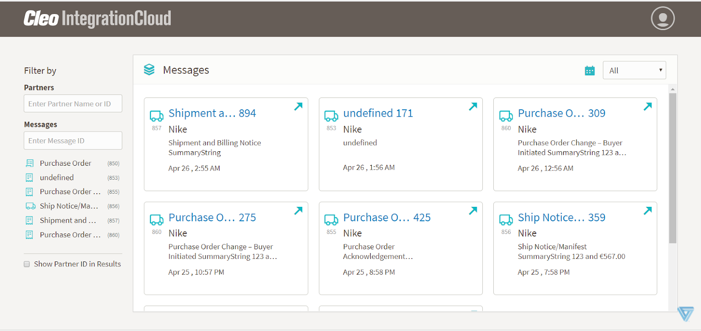
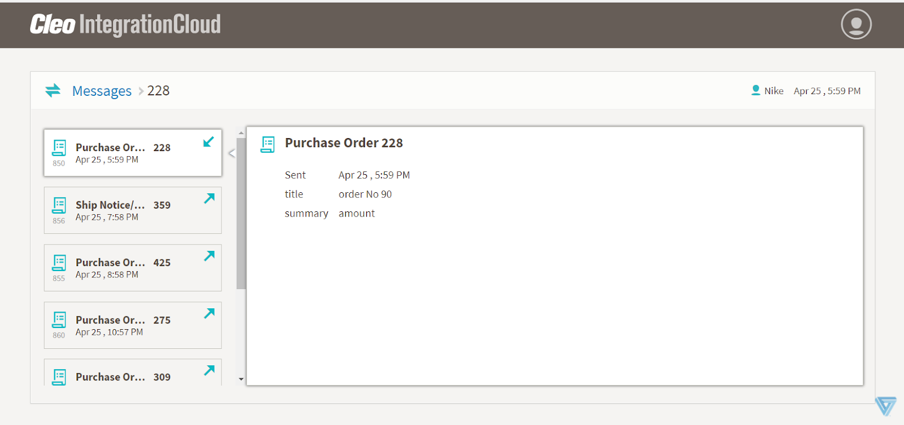
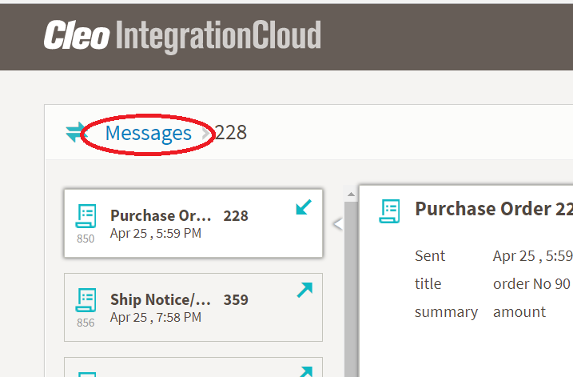

# Messages page

The Messages page displays information about messages on your system in one of two views: 
- Tile view
- Context view

## Tile view

By default, the Messages page displays the Tile view.

In Tile view, the main part of the page is an array of tiles containing high-level information about messages from your system and the left column contains some controls for filtering the messages displayed.

You can filter the messages displayed by partner, message ID, message type, and time range.

Click any message tile to display the Context view. 

## Context view
The Context view displays the message you clicked as part of a series of related messages. 

The left column displays a set of tiles (one message per tile) listed in chronological order. By default, the main part of the page displays detailed about the first message in the list. Click any tile in the left column to display detailed information about that message in the main part of the page.

Click Messages to return to the Tile view of the Messages page.

